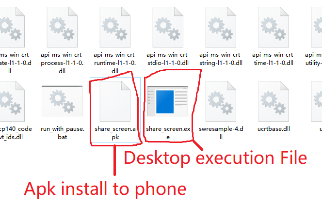
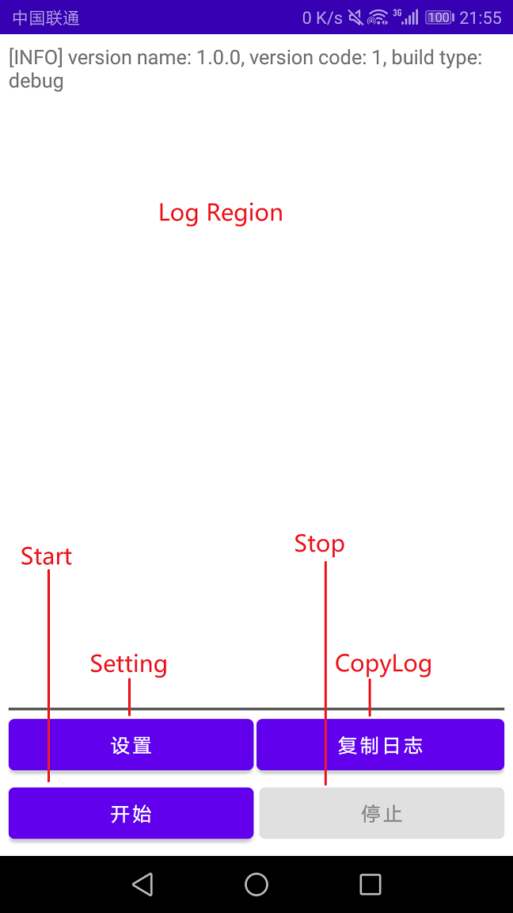

# share screen(v1.0.0)
this project inspire by [scrcpy](https://github.com/Genymobile/scrcpy), translate android screen to desktop window by tcp connection.
also we have app in android instead of use adb.

# Features
- auto connect if two device in same network, also support direct connect remote address.
- support hardware decode.
- open source/clear/free.

# Support Devices
current test on follow devices:

windows system:
- windows 10 x64.

android system:
- HONOR 6x(android 8.0).
- REDMI NOTE 10PRO(android 11.0).

so, we assume the follows will be support:
- windows 7 and up x64.
- android 8.0 and up.

i have no plan to support windows x86, i am a lttle busy in real life.
but i have plan to support linux system.

# How to use?
- Download [share_screen_x64_v1.0.0.7z](https://github.com/llcxiongmao/share_screen/releases/download/v1.0.0/share_screen_x64_v1.0.0.7z) and unzip.
    - install share_screen.apk to your phone.
    - share_screen.exe is our desktop execution.
- **if two device in same network**, for example: two device in the same wifi.
    - run `share_screen.exe`.
    - open android app and click start button. here we go.
- also, your can direct connect remote address:
```
; change 192.168.1.1 to your address
share_screen.exe -ip=192.168.1.2
```

**screenshot**:




# Config options
TODO

# Build
TODO

# Developers
TODO

# Licence
MIT License

Copyright (c) 2022 llcxiongmao(llcxiongmao@163.com)

Permission is hereby granted, free of charge, to any person obtaining a copy
of this software and associated documentation files (the "Software"), to deal
in the Software without restriction, including without limitation the rights
to use, copy, modify, merge, publish, distribute, sublicense, and/or sell
copies of the Software, and to permit persons to whom the Software is
furnished to do so, subject to the following conditions:

The above copyright notice and this permission notice shall be included in all
copies or substantial portions of the Software.

THE SOFTWARE IS PROVIDED "AS IS", WITHOUT WARRANTY OF ANY KIND, EXPRESS OR
IMPLIED, INCLUDING BUT NOT LIMITED TO THE WARRANTIES OF MERCHANTABILITY,
FITNESS FOR A PARTICULAR PURPOSE AND NONINFRINGEMENT. IN NO EVENT SHALL THE
AUTHORS OR COPYRIGHT HOLDERS BE LIABLE FOR ANY CLAIM, DAMAGES OR OTHER
LIABILITY, WHETHER IN AN ACTION OF CONTRACT, TORT OR OTHERWISE, ARISING FROM,
OUT OF OR IN CONNECTION WITH THE SOFTWARE OR THE USE OR OTHER DEALINGS IN THE
SOFTWARE.